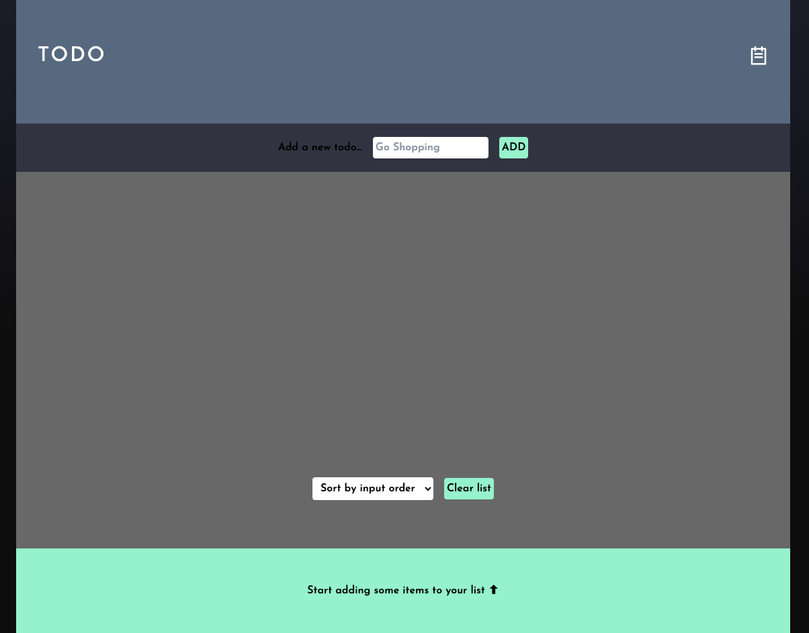

# React TODO/Shopping list App

## Table of contents

- [Overview](#overview)
  - [Screenshot](#screenshot)
  - [Links](#links)
- [My process](#my-process)
  - [Built with](#built-with)
  - [What I learned](#what-i-learned)
  - [Continued development](#continued-development)
  - [Useful resources](#useful-resources)
- [Author](#author)

## Overview

### Screenshot

### Links

- GitHub URL: [Code for TODO List App ](https://github.com/J-R77-stack/Shopping-to-get-list-react)
- Live Site URL: [Live site for TODO List App ](https://shopping-to-get-list-react.vercel.app/)

## My process

### Built with

- Semantic HTML5 markup
- Mobile-first workflow
- [React](https://reactjs.org/) - JS library
- [Tailwind](https://tailwindcss.com/) - CSS Framework
- [Vercel](https://vercel.com/) - For Deployment
- [Google Fonts](https://fonts.google.com/)
- [Git](https://git-scm.com/) \* Used for version control.
- [GitHub](https://github.com/) \* Used to store the code once pushed from Git.

### What I learned

This was my third project using React, and my second using Tailwind. I learnt and understood how to structure the code and seperate components into there own files that will interact with each other. I started to get a further grasp of props and state, particlary how to lift state up to a parent component so its able to be used by the whole app and not just restricted to a single component.

### Continued development

Contiue to cement the fundamentals of react while building a more real world project

### Useful resources

- [w3schools](https://www.w3schools.com/) - A great webpage for someone beginning their journey with code.
- [stackoverflow](https://stackoverflow.com/) - Another very useful site.
- [Tailwind](https://tailwindcss.com/docs/installation/) - Docs for Tailwind.

## Author

- Frontend Mentor - [@J-R77-stack](https://www.frontendmentor.io/profile/J-R77-stack)
- Linkedin - [@johnny-ramsay](https://www.linkedin.com/in/johnny-ramsay-developer/)
- My Portfolio - [@johnny-ramsay](https://my-portfolio-nu-two-52.vercel.app/)
